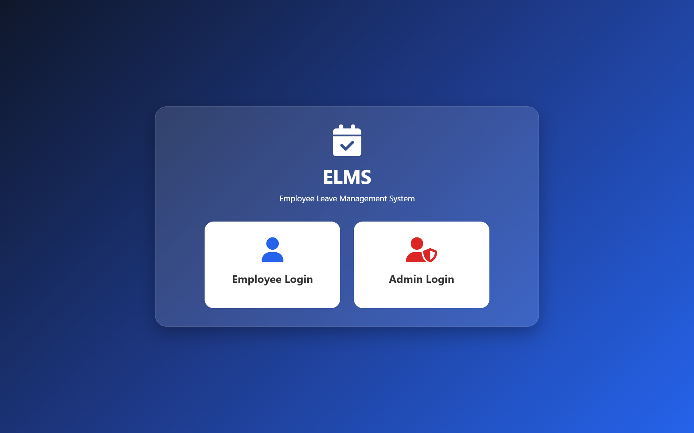
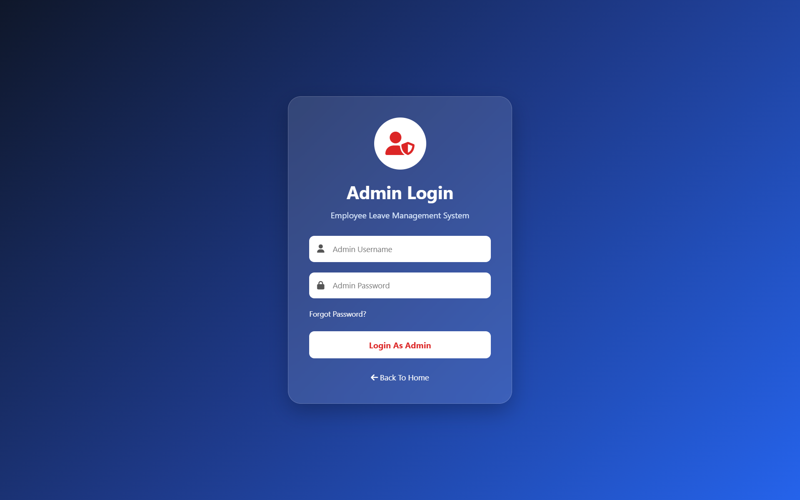
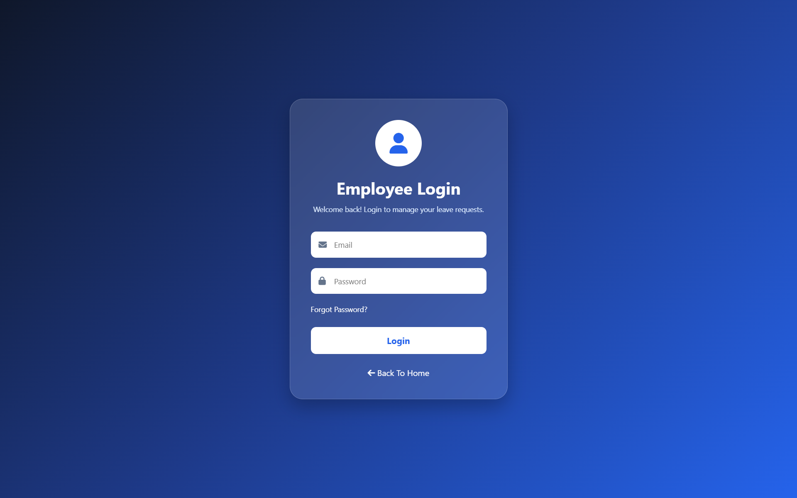
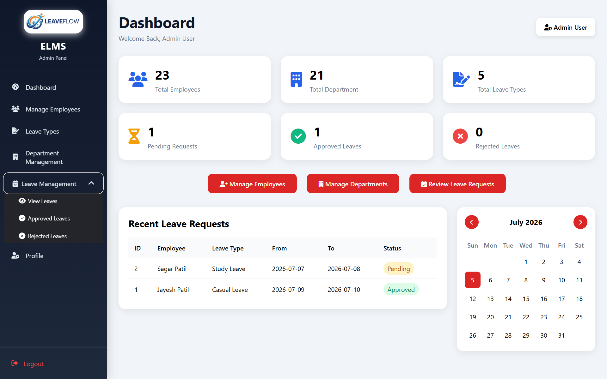
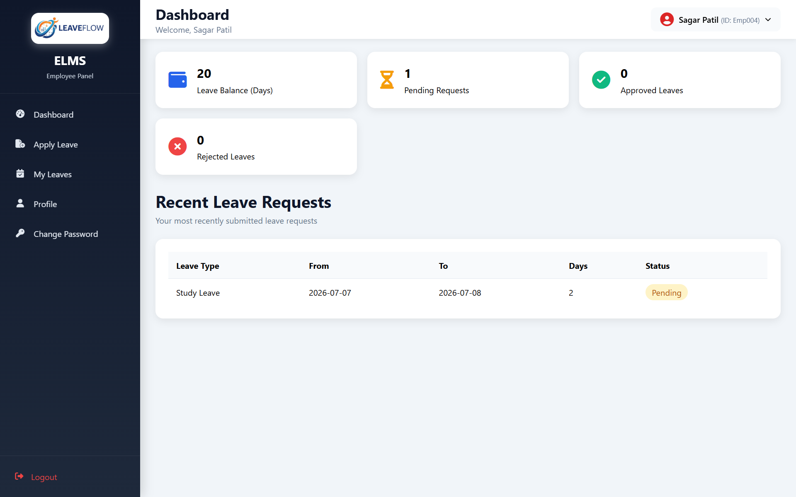
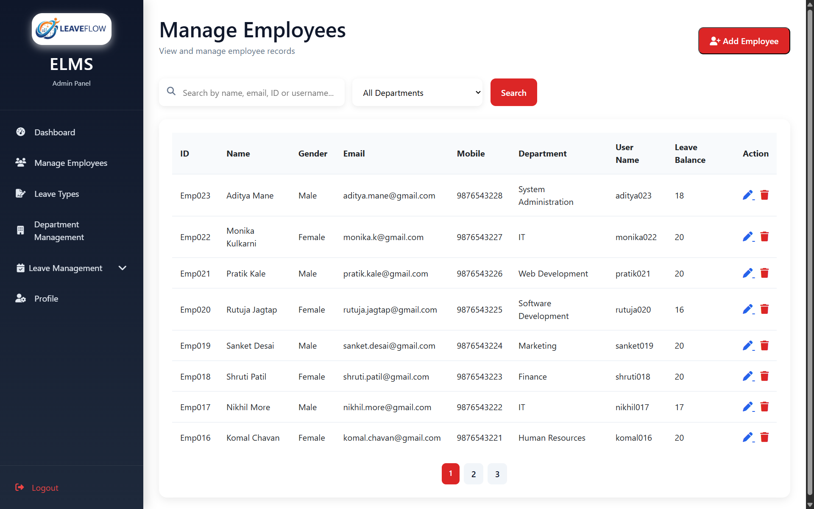
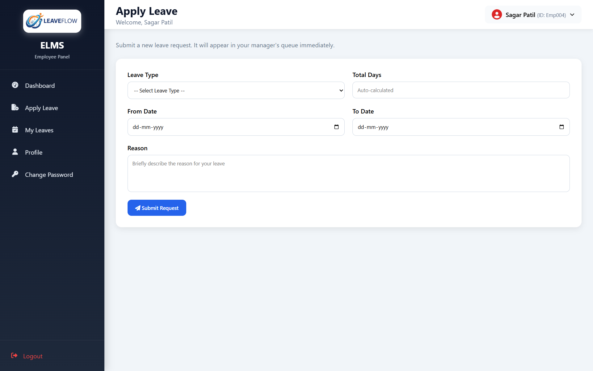
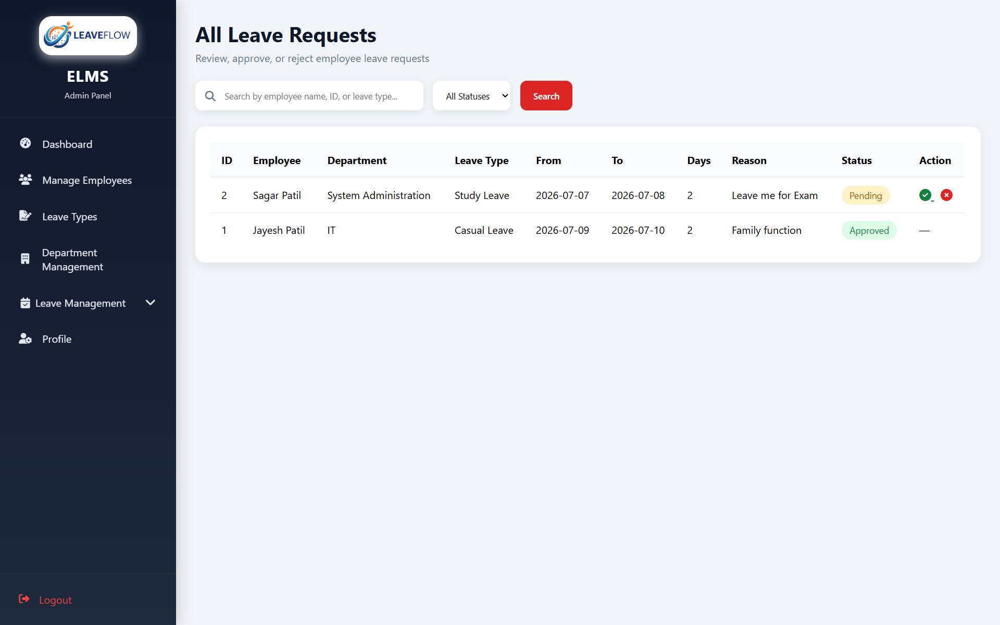
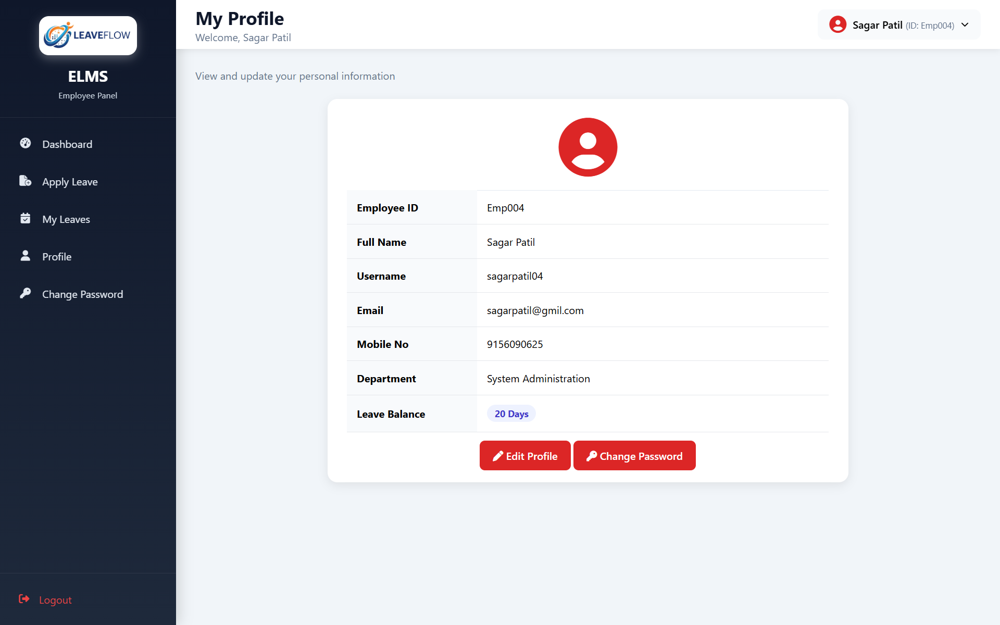

<div align="center">

# 🗂️ ELMS — Employee Leave Management System
</div>

---

## 📖 Project Description

**ELMS (Employee Leave Management System)** is a full-stack web application that digitizes the entire employee leave request and approval process for an organization. It replaces manual, paper-based or spreadsheet-driven leave tracking with a centralized, role-based web portal.

### Purpose & Problem It Solves

Manually tracking employee leave — via email, paper forms, or shared spreadsheets — is error-prone, hard to audit, and gives employees no visibility into the status of their requests. ELMS solves this by providing:

- A **single source of truth** for every leave request, its status, and its history.
- **Automatic leave balance tracking**, so approvals directly deduct from an employee's remaining leave days.
- **Instant visibility** for both sides — employees see real-time status updates, and admins see every request the moment it's submitted, with no manual synchronization step.
- **Secure, role-separated access**, so employee data and administrative actions are properly gated behind authentication.

### Main Functionality

- Employees can apply for leave, track their request history, cancel pending requests, and manage their own profile.
- Admins can manage the employee directory, departments, and leave types, and review/approve/reject every leave request organization-wide from a live dashboard.

### User Roles

| Role | Description |
|---|---|
| **Admin** | Manages employees, departments, and leave types; reviews and approves/rejects all leave requests; views organization-wide statistics. |
| **Employee** | Applies for leave, views personal leave history and balance, manages their own profile, and cancels pending requests. |

---

## ✨ Features

### 🛠️ Admin Module

- 🔐 Secure login with hashed-password verification
- 📊 Live dashboard — total employees, departments, leave types, and pending / approved / rejected leave counts, plus a recent-requests table
- 👥 **Manage Employees** — full Create / Read / Update / Delete, with search (name, email, ID, username), department filter, and pagination
- 🏢 **Manage Departments** — full CRUD (Add / Edit / Delete)
- 🏷️ **Manage Leave Types** — full CRUD (Add / Edit / Delete)
- 📋 **View All Leave Requests** — search, filter by status, pagination, and one-click **Approve** / **Reject** actions
- ✅ **Approved Leaves** and ❌ **Rejected Leaves** — dedicated filtered history views
- 🔄 Automatic **leave balance deduction** on approval
- 👤 Admin profile view with **Change Password**

### 🧑‍💼 Employee Module

- 🔐 Secure login (separate portal from Admin)
- 📊 Personal dashboard — current leave balance, pending / approved / rejected request counts, recent requests
- 📝 **Apply Leave** — leave types loaded dynamically from the database, live day-count preview, full server-side date validation
- 📜 **My Leaves** — complete leave history with status badges; **cancel** any request still in *Pending* status
- 👤 **Profile** — view and edit personal details, with **profile picture upload**
- 🔑 **Change Password** (separate from Admin's password flow)
- 🧭 Persistent sidebar + topbar navigation with a welcome message, employee ID, and profile dropdown

### 🔒 Security Features

- **Password hashing** using PBKDF2-HMAC-SHA256 (65,536 iterations + per-user random salt) — no plain-text passwords are ever stored
- **Servlet filters** (`AdminAuthFilter`, `EmployeeAuthFilter`) guard every page under `/admin/*` and `/employee/*`, blocking direct URL access without a valid session and redirecting to the correct login page
- **Role-based separation** — the Admin and Employee modules are fully isolated, each with its own login, session attributes, and filter
- **Session timeout** configuration in `web.xml`
- **SQL Injection prevention** — every single query across every DAO uses `PreparedStatement`, with no string-concatenated SQL anywhere in the codebase
- **Custom error handling** — a friendly `error.jsp` is wired into `web.xml` for 404 / 500 / uncaught exceptions

---

## 🧰 Technologies Used

| Technology | Role in Project |
|---|---|
| **Java** | Core application language (Servlets, DAOs, business logic) |
| **JDBC** | Database connectivity layer (`java.sql`, `PreparedStatement`) |
| **Servlets (Jakarta)** | Controller layer — request handling, session management |
| **JSP (Jakarta)** | View layer — all Admin and Employee pages |
| **MySQL** | Relational database (5 core tables) |
| **HTML5** | Page markup |
| **CSS3** | Custom styling (organized per module: admin, employee, login) |
| **JavaScript** | Client-side interactivity (date calculations, dropdown toggles, calendar widget) |
| **Bootstrap 5** | Modal dialogs and grid layout (Admin CRUD forms) |
| **Font Awesome** | Iconography across the UI |
| **Apache Tomcat** | Servlet container / application server |
| **Eclipse IDE** | Development environment (Dynamic Web Project) |
| **MySQL Connector/J** | JDBC driver for MySQL |

---

## 🗄️ Database Tables

| Table | Purpose |
|---|---|
| **`admin`** | Stores administrator accounts — `admin_id`, `full_name`, `username`, `password` (hashed), `email` — used for admin authentication and profile display. |
| **`employee`** | Stores employee records — `sr_no`, `emp_id`, `name`, `gender`, `email`, `mobile_no`, `department`, `user_name`, `password` (hashed), `leave_balance`, `profile_pic`, `added_date` — used for authentication, profile management, and leave balance tracking. |
| **`department`** | Lookup table for organizational departments — `dept_id`, `dept_name`, `dept_code`, `description` — used to populate department dropdowns and employee records. |
| **`leave_type`** | Lookup table for types of leave (Casual, Sick, Earned, Maternity, etc.) — `leave_id`, `leave_name`, `leave_code`, `description` — used to populate the Apply Leave form. |
| **`leave_request`** | Core transactional table for the leave workflow — `leave_id`, `emp_id` (FK → `employee.sr_no`), `leave_type`, `from_date`, `to_date`, `total_days`, `reason`, `status`, `admin_remarks`, `applied_date`, `updated_date` — records every leave application and its lifecycle from submission to approval/rejection. |

---

## 📁 Project Structure

```
ELMS/
├── src/main/java/com/elms/
│   ├── controller/                     # Servlets (one responsibility each — MVC controller layer)
│   │   ├── AdminLoginServlet.java
│   │   ├── AdminLogoutServlet.java
│   │   ├── AdminChangePasswordServlet.java
│   │   ├── EmployeeLoginServlet.java
│   │   ├── EmployeeLogoutServlet.java
│   │   ├── EmployeeChangePasswordServlet.java
│   │   ├── EmployeeEditProfileServlet.java
│   │   ├── AddEmployeeServlet.java / EditEmployeeServlet.java / DeleteEmployeeServlet.java
│   │   ├── AddDepartmentServlet.java / EditDepartmentServlet.java / DeleteDepartmentServlet.java
│   │   ├── AddLeaveTypeServlet.java / EditLeaveTypeServlet.java / DeleteLeaveTypeServlet.java
│   │   ├── ApplyLeaveServlet.java
│   │   ├── CancelLeaveServlet.java
│   │   └── UpdateLeaveStatusServlet.java
│   ├── dao/                            # JDBC data access layer (PreparedStatement, try-with-resources)
│   │   ├── AdminDao.java
│   │   ├── EmployeeDao.java
│   │   ├── DepartmentDao.java
│   │   ├── LeaveTypeDao.java
│   │   └── LeaveRequestDao.java
│   ├── entity/                         # Plain data objects
│   │   ├── Admin.java
│   │   ├── Employee.java
│   │   ├── Department.java
│   │   ├── LeaveType.java
│   │   └── LeaveRequest.java
│   ├── filter/                         # Session security
│   │   ├── AdminAuthFilter.java
│   │   └── EmployeeAuthFilter.java
│   └── util/
│       ├── DbConnection.java           # JDBC connection factory
│       └── PasswordUtil.java           # PBKDF2 password hashing
│
└── src/main/webapp/
    ├── admin/                          # Admin-facing JSP pages
    │   ├── admin_login.jsp
    │   ├── adminDashboard.jsp
    │   ├── manageEmployees.jsp
    │   ├── manageDepartment.jsp
    │   ├── leaveType.jsp
    │   ├── viewLeaves.jsp
    │   ├── approvedLeaves.jsp
    │   ├── rejectedLeaves.jsp
    │   ├── adminProfile.jsp
    │   └── sidebar_admin.jsp
    ├── employee/                       # Employee-facing JSP pages
    │   ├── employee_login.jsp
    │   ├── dashboard_employee.jsp
    │   ├── applyLeave_employee.jsp
    │   ├── myLeave_employee.jsp
    │   ├── profile_employee.jsp
    │   ├── changePassword_employee.jsp
    │   ├── Sidebar_employee.jsp
    │   └── Topbar_employee.jsp
    ├── css/
    │   ├── admin_section/
    │   ├── employee_section/
    │   └── login/
    ├── js/
    │   ├── script.js
    │   └── calendar.js
    ├── images/
    │   └── logo.png
    ├── WEB-INF/
    │   ├── web.xml
    │   └── lib/                        # MySQL Connector/J and supporting jars
    ├── index.jsp                       # Role-selection landing page
    └── error.jsp                       # Custom 404 / 500 error page
```

---

## ✅ Prerequisites

Before running the project, install:

- **Java Development Kit (JDK) 17** or later
- **Apache Tomcat 10.1+ / 11.x** (this project uses `jakarta.servlet.*` APIs — it will **not** run on Tomcat 9 or older)
- **MySQL Server 8.0** or later
- **Eclipse IDE for Enterprise Java and Web Developers** (or any IDE supporting Dynamic Web Projects)
- **MySQL Connector/J** (already bundled in `WEB-INF/lib`)
- **Git** (to clone the repository)

---

## 🚀 Installation and Setup Guide

### 1. Clone the Repository
```bash
git clone https://github.com/lekhitpatil2003/ELMS.git
cd ELMS
```

### 2. Import into Eclipse
- Open Eclipse → **File → Import → Existing Projects into Workspace**
- Select the cloned `ELMS` folder and finish the import
- Right-click the project → **Properties → Targeted Runtimes** → select your Tomcat 10.1+/11.x runtime

### 3. Configure MySQL Database
- Start your MySQL server
- Create a new database (e.g., `elms`) or let the SQL script below create it for you

### 4. Execute the SQL Script
Run the provided schema script against your MySQL server:
```bash
mysql -u root -p < database/schema.sql
```
This creates all 5 tables (`admin`, `employee`, `department`, `leave_type`, `leave_request`) and seeds default login accounts.

### 5. Configure the JDBC Connection
Open `src/main/java/com/elms/util/DbConnection.java` and update the URL, username, and password constants to match your local MySQL instance (see **Database Configuration** below).

### 6. Add the MySQL Connector
The MySQL Connector/J driver is already included in `WEB-INF/lib`. If you're setting up a fresh environment, ensure this jar is on the deployment classpath.

### 7. Configure Apache Tomcat
- In Eclipse, add your Tomcat server (**Window → Preferences → Server → Runtime Environments**, or via the **Servers** view)
- Right-click the project → **Run As → Run on Server** and select your configured Tomcat instance

### 8. Run the Project
- Once deployed, open a browser and go to:
  ```
  http://localhost:8080/ELMS/
  ```
- Choose **Employee Login** or **Admin Login** from the landing page.

---

## ⚙️ Database Configuration

Sample JDBC configuration from `DbConnection.java`:

```java
private static final String URL =
    "jdbc:mysql://localhost:3306/elms?useSSL=false&serverTimezone=UTC&allowPublicKeyRetrieval=true";
private static final String USER = "root";
private static final String PASSWORD = "your_mysql_password";
```

> ⚠️ Update `USER` and `PASSWORD` to match your own MySQL credentials before running the project.

---

## 🖼️ Screenshots

 **Login Page**  
 **Admin Login**  
 **Employee Login**  
 **Admin Dashboard**  
 **Employee Dashboard**   
 **Manage Employees**  
 **Apply Leave**   
 **Leave Request**  
 **Employee Profile Page**  

---

## 🔄 Project Workflow

```
 Employee                     Admin                        Employee
────────────                ─────────────                ────────────
Applies for Leave   ──────▶  Reviews Request
(status: Pending)            in "View Leaves"
                                    │
                          ┌─────────┴─────────┐
                          ▼                   ▼
                      Approves            Rejects
                  (balance deducted)   (remarks added)
                          │                   │
                          └─────────┬─────────┘
                                    ▼
                          Status updated in DB
                                    │
                                    ▼
                          Employee views updated
                          status in "My Leaves"
                          / Dashboard
```

Employees can also **cancel** a request themselves, but only while it remains in *Pending* status — once an admin has acted on it, the decision is final.

---

## 🔮 Future Enhancements

- 📧 Email notifications on leave submission / approval / rejection
- 📈 Advanced leave balance tracking (accrual rules, carry-forward, year-end reset)
- 🕒 Attendance management integration
- 📊 Reports and analytics dashboard (leave trends, department-wise usage)
- 📄 Export leave reports to PDF / Excel
- 🖼️ Enhanced profile picture management (cropping, size validation UI)
- 🔗 REST API layer for mobile app / third-party integration
- 🔑 Forgot Password / email-based password reset flow
- 🌐 Multi-language (i18n) support

---

## 👤 Author

**Lekhit Patil**

- 🔗 GitHub: [github.com/lekhitpatil2003](https://github.com/lekhitpatil2003)
- 💼 LinkedIn: [linkedin.com/in/lekhitpatil](https://www.linkedin.com/in/lekhitpatil/)
- 📧 Email: [patillekhit@gmail.com](mailto:patillekhit@gmail.com)

---

## 📝 Resume-Friendly Project Summary

> **Employee Leave Management System (ELMS)** | Java, JDBC, Servlets, JSP, MySQL, Bootstrap
> Designed and developed a full-stack, role-based web application for managing employee leave requests end-to-end. Implemented secure authentication with PBKDF2 password hashing, servlet-filter-based session security, and a complete MVC architecture (Servlets → DAO → JSP) across 5 relational database tables. Built an automated leave approval workflow with real-time leave balance tracking, plus full CRUD administration for employees, departments, and leave types, including search, filtering, and pagination. Ensured SQL-injection-safe data access using `PreparedStatement` throughout.

**Key highlights for resume bullet points:**
- Built a 2-role (Admin/Employee) leave management system using Java Servlets, JSP, JDBC, and MySQL
- Implemented secure password hashing (PBKDF2-HMAC-SHA256) and filter-based session authentication
- Designed a 5-table relational schema and a full leave approval workflow with automatic balance tracking
- Developed full CRUD modules with search, filtering, and pagination for employees, departments, and leave types
- Followed MVC architecture with a clean separation of Servlets, DAOs, and Entities

---

## 🏷️ GitHub Topics

```
java  jsp  servlets  jdbc  mysql  bootstrap  apache-tomcat  eclipse-ide
leave-management-system  employee-management  web-application  mvc-architecture
crud-application  java-web-project  full-stack-java  student-project
```

---

<div align="center">

⭐ If you found this project useful or interesting, consider giving it a star!

</div>
